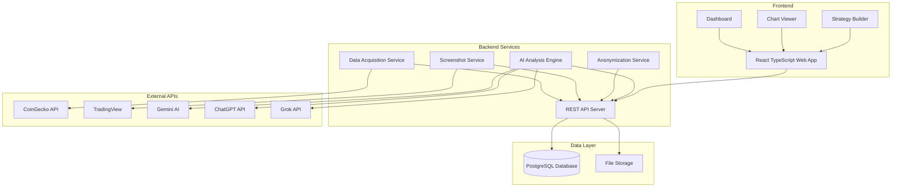

# 🚀 Crypto Coin Strategy Builder V5 - Complete Project Specification

## 📋 Table of Contents
1. [Executive Summary](#executive-summary)
2. [System Architecture Overview](#system-architecture-overview)
3. [5-Step Workflow](#5-step-workflow)
4. [Technical Requirements](#technical-requirements)
5. [Screen Designs & User Flow](#screen-designs--user-flow)
6. [Database Schema](#database-schema)
7. [API Integration Details](#api-integration-details)
8. [Implementation Timeline](#implementation-timeline)
9. [Risk Management](#risk-management)

---

## 📊 Executive Summary

The Crypto Coin Strategy Builder V5 is a comprehensive web application that assists users in analyzing cryptocurrency data using AI tools to build and track trading strategies. The system processes the top 1000 crypto/USDT pairs, captures 12-month chart data, anonymizes it for unbiased AI analysis, and provides tools for strategy creation and performance tracking.

### 🎯 Core Objectives
- **Data Acquisition**: Retrieve top 1000 crypto pairs from CoinGecko API
- **Chart Capture**: Screenshot 12-month daily charts from TradingView (1920x1080)
- **Anonymization**: Remove coin identifiers while preserving chart patterns
- **AI Analysis**: Multi-AI trend analysis with confidence scoring (1-1000 ranking)
- **Strategy Management**: User-friendly strategy creation and performance tracking

### 📈 MVP Scope
- **Initial Release**: Top 250 crypto pairs by market cap
- **Full Release**: Expand to top 1000 pairs
- **AI Providers**: Start with Gemini, expand to ChatGPT and Grok

---

## 🏗️ System Architecture Overview



---

## 🔄 5-Step Workflow

### Step 1: Data Acquisition 📥
**Objective**: Retrieve cryptocurrency market data from CoinGecko API

**Process**:
1. Connect to CoinGecko API using existing key: `CG-pE85bxEYTmunUjTjakjotw3N`
2. Fetch top coins by market cap (250 per batch)
3. Apply 2-minute delays between batches (free tier compliance)
4. Store data in PostgreSQL database
5. Generate timestamped CSV exports

**Existing Foundation**: `download-usdt-pairs.js` - fully functional

**User Interface**: 
- Progress dashboard showing batch download status
- Real-time logging of API calls and success rates
- Configuration panel for MVP vs Full mode

### Step 2: Chart Screenshots 📸
**Objective**: Capture 12-month daily candlestick charts from TradingView

**Process**:
1. Generate TradingView URLs for each USDT pair
2. Use browser automation (Puppeteer) at 1920x1080 resolution
3. Navigate to each chart and wait for full loading
4. Capture screenshot with proper naming convention
5. Validate image quality and dimensions
6. Store in organized folder structure

**Technical Requirements**:
- **Resolution**: 1920x1080 (NON-NEGOTIABLE - this is absolutely critical)
- **Chart Type**: Daily candlesticks
- **Time Period**: 12 months
- **URL Format**: https://www.tradingview.com/chart/?symbol={SYMBOL}USDT&interval=1D
- **File Format**: PNG
- **Naming**: `{SYMBOL}USDT_{timestamp}.png`
- **Validation**: Screenshot MUST be exactly 1920x1080 or cropping will fail

**User Interface**:
- Batch screenshot progress tracker
- Failed capture retry management
- Quality validation dashboard
- Storage usage monitoring

### Step 3: Chart Anonymization 🎭
**Objective**: Remove coin identifiers while preserving chart patterns

**Process**:
1. Load original screenshots from Step 2
2. Apply OCR to detect text elements
3. Remove coin symbols, dates, and price labels
4. Preserve all candlestick patterns and trend lines
5. Generate anonymous coin IDs (coin001, coin002, etc.)
6. Store mapping in database for user reference

**Existing Foundation**: `batch-crop-usdt-pairs.py` - needs enhancement

**User Interface**:
- Before/after comparison view
- Anonymization quality validation
- Mapping table showing original vs anonymous IDs
- Batch processing progress

### Step 4: AI Analysis 🤖
**Objective**: Multi-AI trend analysis with confidence scoring

**Process**:
1. Submit anonymized charts to AI providers
2. Collect trend analysis (up/down/sideways confidence)
3. Apply strict JSON schema validation
4. Calculate consensus scores across multiple AIs
5. Generate rankings from 1-1000
6. Store results in structured format

**Existing Foundation**: `trend-analysis-v3.js` - working Gemini integration

**AI Providers**:
- **Gemini API**: Current implementation (40% weight)
- **ChatGPT API**: To be added (40% weight)
- **Grok API**: Future implementation (20% weight)

**User Interface**:
- AI analysis progress dashboard
- Confidence score visualization
- Ranking table with sorting/filtering
- AI provider comparison view

### Step 5: Strategy Management 📊
**Objective**: User strategy creation and performance tracking

**Process**:
1. Strategy builder wizard with drag-and-drop rules
2. Link strategies to specific cryptocurrencies
3. Backtest strategies against historical data
4. Track real-time performance
5. Generate performance reports
6. Strategy optimization suggestions

**User Interface**:
- Intuitive strategy creation wizard
- Performance tracking dashboard
- Historical analysis charts
- Strategy comparison tools

---

## 💻 Screen Designs & User Flow

### 🏠 Main Dashboard
```
┌─────────────────────────────────────────────────────────────────┐
│ 🚀 Crypto Strategy Builder V5                    [User] [Settings] │
├─────────────────────────────────────────────────────────────────┤
│ 🔍 Search: [________________] 📊 View: [Original/Anon] 📤 Export │
├─────────────────────────────────────────────────────────────────┤
│ Rank │ Symbol │ AI Score │ Trend    │ Confidence │ Actions     │
├─────────────────────────────────────────────────────────────────┤
│  1   │ BTC    │  95.2%   │ ↗ Up     │   0.952    │ [📊][📈]   │
│  2   │ ETH    │  87.3%   │ ↗ Up     │   0.873    │ [📊][📈]   │
│  3   │ SOL    │  82.1%   │ ↗ Up     │   0.821    │ [📊][📈]   │
│  4   │ ADA    │  45.2%   │ ↔ Side   │   0.452    │ [📊][📈]   │
│  5   │ DOT    │  23.1%   │ ↘ Down   │   0.231    │ [📊][📈]   │
├─────────────────────────────────────────────────────────────────┤
│ ← Previous │ Page 1 of 40 │ Next → │ Showing 1-25 of 1000      │
└─────────────────────────────────────────────────────────────────┘
```

**Features**:
- Sortable columns with visual indicators
- Search functionality with real-time filtering
- Toggle between original coin names and anonymized view
- Contextual help tooltips (❓ icons) explaining each column
- Action buttons: 📊 View Chart, 📈 Create Strategy
- Export functionality for CSV/PDF reports

### 📊 Chart Viewer
```
┌─────────────────────────────────────────────────────────────────┐
│ 📊 Chart Analysis: BTC/USDT (Coin001)         [🏠 Home] [❓ Help] │
├─────────────────────────────────────────────────────────────────┤
│ View: [●Original] [○Anonymized] │ Zoom: [-][100%][+] │ [📤Export] │
├─────────────────────────────────────────────────────────────────┤
│                                                                 │
│  ┌───────────────────────────────────────────────────────────┐  │
│  │                                                           │  │
│  │           📈 CANDLESTICK CHART DISPLAY                   │  │
│  │                                                           │  │
│  │     (1920x1080 TradingView chart with 12-month data)     │  │
│  │                                                           │  │
│  │           [Interactive zoom and pan controls]            │  │
│  │                                                           │  │
│  └───────────────────────────────────────────────────────────┘  │
├─────────────────────────────────────────────────────────────────┤
│ 🤖 AI Analysis Results:                                         │
│ ┌─ Up Trend: 87.3% confidence     ┌─ Down Trend: 8.2%         │
│ ├─ Sideways: 4.5% confidence      ├─ Consensus: STRONG BUY    │
│ └─ Overall Rank: #2 of 1000       └─ Last Updated: 2min ago   │
├─────────────────────────────────────────────────────────────────┤
│ [← Prev: ETH] [Create Strategy 📈] [Next: SOL →]                │
└─────────────────────────────────────────────────────────────────┘
```

**Features**:
- Side-by-side original/anonymized chart toggle
- Interactive zoom and pan controls
- AI analysis overlay with confidence visualization
- Quick navigation between cryptocurrencies
- Direct link to strategy creation
- Export chart for reports

### 📈 Strategy Builder
```
┌─────────────────────────────────────────────────────────────────┐
│ 📈 Strategy Builder: Create New Strategy    [💾 Save] [🏠 Home] │
├─────────────────────────────────────────────────────────────────┤
│ Strategy Name: [High Confidence Trend Following____________] ❓  │
│ Description:   [Buy when AI shows >80% uptrend confidence___]   │
├─────────────────────────────────────────────────────────────────┤
│ 📋 Rules Builder:                                               │
│ ┌─────────────────────────────────────────────────────────────┐ │
│ │ Rule 1: IF [Up Confidence] [>] [0.80] THEN [BUY] [2%]     │ │
│ │         Stop Loss: [5%] │ Take Profit: [15%]               │ │
│ │ [+ Add Rule] [🗑️ Delete Rule]                             │ │
│ └─────────────────────────────────────────────────────────────┘ │
│ ┌─────────────────────────────────────────────────────────────┐ │
│ │ Rule 2: IF [Up Confidence] [<] [0.30] THEN [SELL] [100%]  │ │
│ │         Stop Loss: [3%] │ Take Profit: [N/A]               │ │
│ │ [+ Add Rule] [🗑️ Delete Rule]                             │ │
│ └─────────────────────────────────────────────────────────────┘ │
├─────────────────────────────────────────────────────────────────┤
│ ⚖️ Risk Management:                                            │
│ Max Position Size: [5%] ❓ │ Max Daily Loss: [10%] ❓           │
│ Portfolio Allocation: [Conservative ▼] ❓                       │
├─────────────────────────────────────────────────────────────────┤
│ 🧪 Backtest Results: [Run Backtest]                           │
│ ┌─ Simulated Performance (Last 3 months):                     │ │
│ ├─ Total Return: +23.4% ┌─ Max Drawdown: -8.2%               │ │
│ ├─ Win Rate: 68.2%      ├─ Avg Trade: +2.1%                  │ │
│ └─ Sharpe Ratio: 1.84   └─ Trades: 47                        │ │
├─────────────────────────────────────────────────────────────────┤
│ [🧪 Run Backtest] [💾 Save Strategy] [📤 Export] [🗑️ Delete]   │
└─────────────────────────────────────────────────────────────────┘
```

**Features**:
- Drag-and-drop rule builder with visual programming
- Multiple condition support (AND/OR logic)
- Risk management parameter configuration
- Historical backtesting with performance metrics
- Strategy templates for quick setup
- Export functionality for external use

### 📊 Performance Dashboard
```
┌─────────────────────────────────────────────────────────────────┐
│ 📊 Strategy Performance Dashboard          [📅 Last 30 Days ▼] │
├─────────────────────────────────────────────────────────────────┤
│ 📈 Portfolio Overview:                                          │
│ ┌─ Total Value: $10,456.78 (+$1,234.56) ┌─ Active Strategies: 3 │
│ ├─ Today's P&L: +$45.23 (+0.43%)        ├─ Total Trades: 127   │
│ └─ Monthly Return: +12.4%                └─ Win Rate: 72.4%     │
├─────────────────────────────────────────────────────────────────┤
│ 📋 Active Strategies:                                           │
│ ┌─────────────────────────────────────────────────────────────┐ │
│ │ High Confidence Trend  │ +$234.56  │ 15 trades │ [📊][⚙️]  │ │
│ │ Conservative Scalping  │ +$123.45  │ 32 trades │ [📊][⚙️]  │ │
│ │ Volatility Breakout    │ -$45.67   │ 8 trades  │ [📊][⚙️]  │ │
│ └─────────────────────────────────────────────────────────────┘ │
├─────────────────────────────────────────────────────────────────┤
│ 📈 Performance Chart:                                           │
│ ┌───────────────────────────────────────────────────────────────┐│
│ │        📊 Interactive Performance Chart                       ││
│ │     (Shows portfolio value over time with benchmarks)        ││
│ └───────────────────────────────────────────────────────────────┘│
├─────────────────────────────────────────────────────────────────┤
│ [📈 Create New Strategy] [📊 Detailed Analysis] [📤 Export]     │
└─────────────────────────────────────────────────────────────────┘
```

**Features**:
- Real-time portfolio value tracking
- Strategy performance comparison
- Interactive charts with historical data
- Risk metrics and drawdown analysis
- Strategy optimization suggestions

---

## 🗄️ Database Schema

### Core Tables

```sql
-- Cryptocurrency pairs from CoinGecko
CREATE TABLE crypto_pairs (
    id SERIAL PRIMARY KEY,
    symbol VARCHAR(20) NOT NULL UNIQUE,
    name VARCHAR(100) NOT NULL,
    current_price DECIMAL(20,8),
    market_cap BIGINT,
    market_cap_rank INTEGER,
    volume_24h BIGINT,
    price_change_24h DECIMAL(10,4),
    circulating_supply BIGINT,
    total_supply BIGINT,
    max_supply BIGINT,
    created_at TIMESTAMP DEFAULT CURRENT_TIMESTAMP,
    updated_at TIMESTAMP DEFAULT CURRENT_TIMESTAMP
);

-- Chart screenshot metadata
CREATE TABLE chart_screenshots (
    id SERIAL PRIMARY KEY,
    crypto_pair_id INTEGER REFERENCES crypto_pairs(id),
    original_path TEXT NOT NULL,
    anonymized_path TEXT,
    screenshot_date TIMESTAMP DEFAULT CURRENT_TIMESTAMP,
    resolution VARCHAR(20) DEFAULT '1920x1080',
    chart_period VARCHAR(20) DEFAULT '12M',
    file_size_bytes BIGINT,
    quality_validated BOOLEAN DEFAULT FALSE
);

-- Anonymous coin mapping for AI analysis
CREATE TABLE chart_mappings (
    id SERIAL PRIMARY KEY,
    anonymous_id VARCHAR(20) UNIQUE NOT NULL, -- 'coin001', 'coin002'
    original_symbol VARCHAR(20) NOT NULL,
    crypto_pair_id INTEGER REFERENCES crypto_pairs(id),
    original_chart_path TEXT NOT NULL,
    anonymized_chart_path TEXT NOT NULL,
    created_at TIMESTAMP DEFAULT CURRENT_TIMESTAMP
);

-- AI analysis results
CREATE TABLE ai_analyses (
    id SERIAL PRIMARY KEY,
    chart_mapping_id INTEGER REFERENCES chart_mappings(id),
    provider VARCHAR(20) NOT NULL, -- 'gemini', 'chatgpt', 'grok'
    up_confidence DECIMAL(6,4) NOT NULL,
    down_confidence DECIMAL(6,4) NOT NULL,
    sideways_confidence DECIMAL(6,4) NOT NULL,
    consensus_score DECIMAL(6,4),
    final_rank INTEGER,
    analysis_date TIMESTAMP DEFAULT CURRENT_TIMESTAMP,
    cost_usd DECIMAL(10,4),
    processing_time_ms INTEGER
);

-- Trading strategies
CREATE TABLE strategies (
    id SERIAL PRIMARY KEY,
    name VARCHAR(100) NOT NULL,
    description TEXT,
    rules JSONB NOT NULL,
    risk_parameters JSONB,
    is_active BOOLEAN DEFAULT TRUE,
    created_at TIMESTAMP DEFAULT CURRENT_TIMESTAMP,
    updated_at TIMESTAMP DEFAULT CURRENT_TIMESTAMP
);

-- Strategy execution history
CREATE TABLE strategy_executions (
    id SERIAL PRIMARY KEY,
    strategy_id INTEGER REFERENCES strategies(id),
    crypto_symbol VARCHAR(20),
    action VARCHAR(10) NOT NULL, -- 'BUY', 'SELL', 'HOLD'
    confidence_score DECIMAL(6,4),
    position_size DECIMAL(10,4),
    entry_price DECIMAL(20,8),
    exit_price DECIMAL(20,8),
    profit_loss DECIMAL(15,8),
    outcome VARCHAR(20), -- 'PENDING', 'PROFIT', 'LOSS'
    executed_at TIMESTAMP DEFAULT CURRENT_TIMESTAMP,
    closed_at TIMESTAMP
);
```

### Indexes for Performance

```sql
-- Performance indexes
CREATE INDEX idx_crypto_pairs_rank ON crypto_pairs(market_cap_rank);
CREATE INDEX idx_crypto_pairs_symbol ON crypto_pairs(symbol);
CREATE INDEX idx_chart_screenshots_pair ON chart_screenshots(crypto_pair_id);
CREATE INDEX idx_ai_analyses_chart ON ai_analyses(chart_mapping_id);
CREATE INDEX idx_ai_analyses_rank ON ai_analyses(final_rank);
CREATE INDEX idx_strategy_executions_strategy ON strategy_executions(strategy_id);
CREATE INDEX idx_strategy_executions_date ON strategy_executions(executed_at);
```

---

## 🔌 API Integration Details

### CoinGecko API Integration
```javascript
const COINGECKO_CONFIG = {
    baseUrl: 'https://api.coingecko.com/api/v3',
    apiKey: 'CG-pE85bxEYTmunUjTjakjotw3N',
    endpoints: {
        markets: '/coins/markets',
        prices: '/simple/price'
    },
    rateLimits: {
        batchSize: 250,
        delayBetweenBatches: 120000, // 2 minutes
        maxRetries: 3
    }
};
```

### AI Provider APIs
```javascript
const AI_PROVIDERS = {
    gemini: {
        apiKey: process.env.GEMINI_API_KEY,
        baseUrl: 'https://generativelanguage.googleapis.com/v1beta',
        model: 'gemini-2.0-flash',
        costPerRequest: 0.01,
        weight: 0.4
    },
    chatgpt: {
        apiKey: process.env.OPENAI_API_KEY,
        baseUrl: 'https://api.openai.com/v1',
        model: 'gpt-4-vision-preview',
        costPerRequest: 0.02,
        weight: 0.4
    },
    grok: {
        apiKey: process.env.GROK_API_KEY,
        baseUrl: 'https://api.x.ai/v1',
        model: 'grok-vision-beta',
        costPerRequest: 0.015,
        weight: 0.2
    }
};
```

### REST API Endpoints
```javascript
// Data endpoints
GET    /api/crypto-pairs              // List all pairs with pagination
GET    /api/crypto-pairs/:symbol      // Get specific pair details
POST   /api/crypto-pairs/sync         // Trigger data sync from CoinGecko

// Chart endpoints
GET    /api/charts/:symbol            // Get chart data and paths
POST   /api/charts/screenshot/:symbol // Trigger screenshot capture
GET    /api/charts/anonymous/:id      // Get anonymized chart by ID

// AI Analysis endpoints
GET    /api/analysis/rankings         // Get full ranking table (1-1000)
GET    /api/analysis/:symbol          // Get AI analysis for specific coin
POST   /api/analysis/bulk             // Trigger bulk AI analysis

// Strategy endpoints
GET    /api/strategies                // List user strategies
POST   /api/strategies                // Create new strategy
PUT    /api/strategies/:id            // Update strategy
DELETE /api/strategies/:id            // Delete strategy
POST   /api/strategies/:id/backtest   // Run strategy backtest
GET    /api/strategies/:id/performance // Get strategy performance data
```

---

## ⏱️ Implementation Timeline

### Phase 1: Foundation (Weeks 1-2)
**Goal**: Core data acquisition and storage
- ✅ Enhanced CoinGecko API integration
- ✅ Database schema creation and optimization
- ✅ Basic REST API endpoints
- ✅ Data validation and error handling

### Phase 2: Chart Processing (Weeks 3-4)
**Goal**: Automated chart capture and anonymization
- 📸 TradingView screenshot automation
- 🎭 Chart anonymization pipeline
- 📁 File organization and storage
- ✅ Quality validation systems

### Phase 3: AI Integration (Weeks 5-6)
**Goal**: Multi-AI analysis engine
- 🤖 Enhanced Gemini integration
- 🔄 ChatGPT API integration
- 📊 Consensus scoring algorithms
- 📈 Ranking system (1-1000)

### Phase 4: Frontend Development (Weeks 7-9)
**Goal**: User interface and experience
- 🏠 Main dashboard with sortable tables
- 📊 Chart viewer with interactive features
- 📈 Strategy builder interface
- 📱 Responsive design implementation

### Phase 5: Strategy Management (Weeks 10-11)
**Goal**: Complete strategy ecosystem
- 📋 Strategy creation wizard
- 📊 Performance tracking dashboard
- 🧪 Backtesting functionality
- 📤 Export and reporting features

### Phase 6: Testing & Optimization (Week 12)
**Goal**: Production readiness
- 🧪 Comprehensive testing suite
- ⚡ Performance optimization
- 🔒 Security hardening
- 📚 Documentation completion

---

## ⚠️ Risk Management

### Technical Risks
1. **API Rate Limits**: Mitigated by proper batch processing and delays
2. **AI API Costs**: Controlled by free tier optimization and cost tracking
3. **Large File Storage**: Managed with compression and cleanup routines
4. **Browser Automation Reliability**: Handled with retry logic and validation

### Business Risks
1. **API Key Limitations**: Plan for multiple API keys and provider diversification
2. **Chart Quality**: Implement comprehensive validation and manual review processes
3. **AI Analysis Accuracy**: Use consensus scoring and manual verification samples
4. **User Adoption**: Focus on intuitive design and comprehensive help documentation

### Mitigation Strategies
- **Monitoring**: Real-time system monitoring and alerting
- **Backup Plans**: Alternative API providers and data sources
- **Incremental Deployment**: Start with MVP (250 pairs) before full scale
- **User Feedback**: Regular user testing and feedback incorporation

---

## 🎯 Success Metrics

### MVP Success Criteria
- ✅ Successfully process 250 crypto pairs
- ✅ Generate accurate AI analysis rankings
- ✅ Provide functional strategy creation tools
- ✅ Maintain 99% system uptime
- ✅ Stay within free API tier limits

### Full Release Goals
- 📈 Process 1000 crypto pairs efficiently
- 🤖 Integrate 3 AI providers with consensus
- 👥 Support 100+ concurrent users
- 📊 Track 1000+ user-created strategies
- ⚡ Maintain <2 second page load times

---

*This specification serves as the master blueprint for the Crypto Coin Strategy Builder V5 development. All implementation should reference this document for consistency and completeness.*

**Last Updated**: January 2025  
**Version**: 1.0  
**Status**: Ready for Development  

---

## 🏷️ Attribution Requirements

When displaying crypto price and market data from CoinGecko, include text attribution such as 'Data provided by [CoinGecko](https://www.coingecko.com)' or 'Powered by [CoinGecko API](https://www.coingecko.com/en/api)' and include the CoinGecko logo linking to https://www.coingecko.com.

For AI analysis features, appropriate attribution will be displayed for each AI provider used in the analysis.
