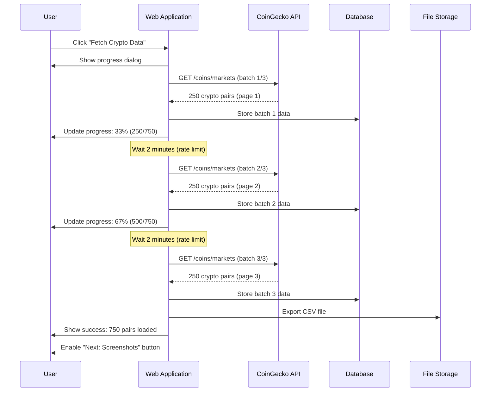
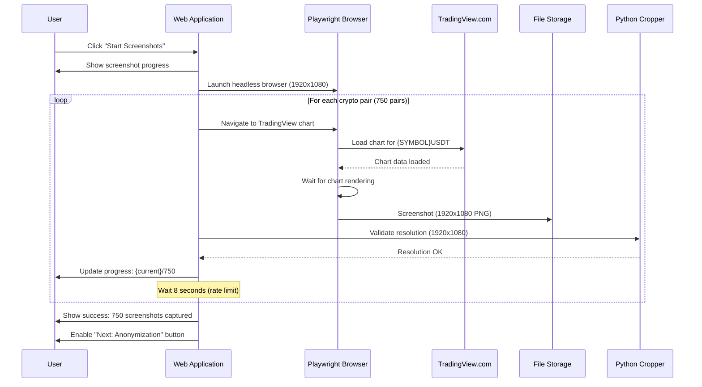
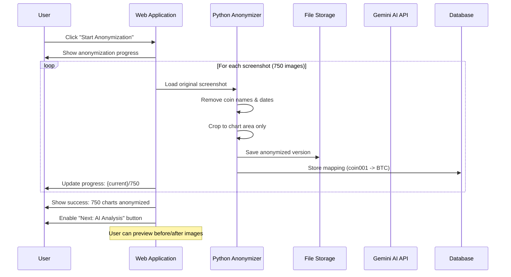
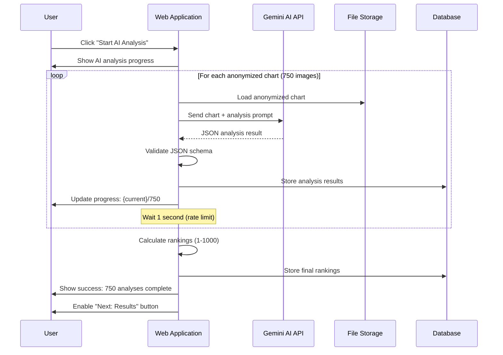
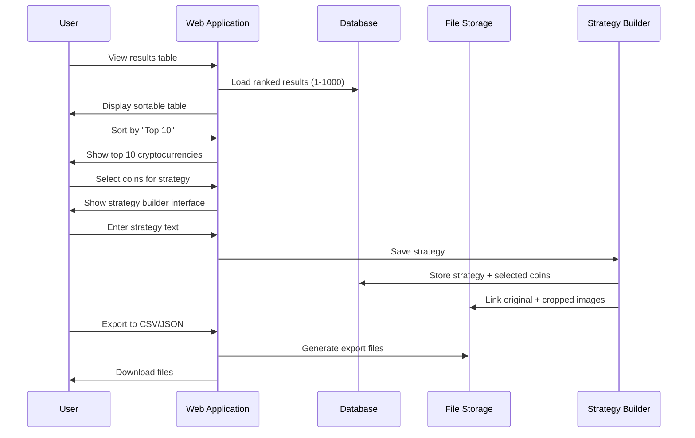
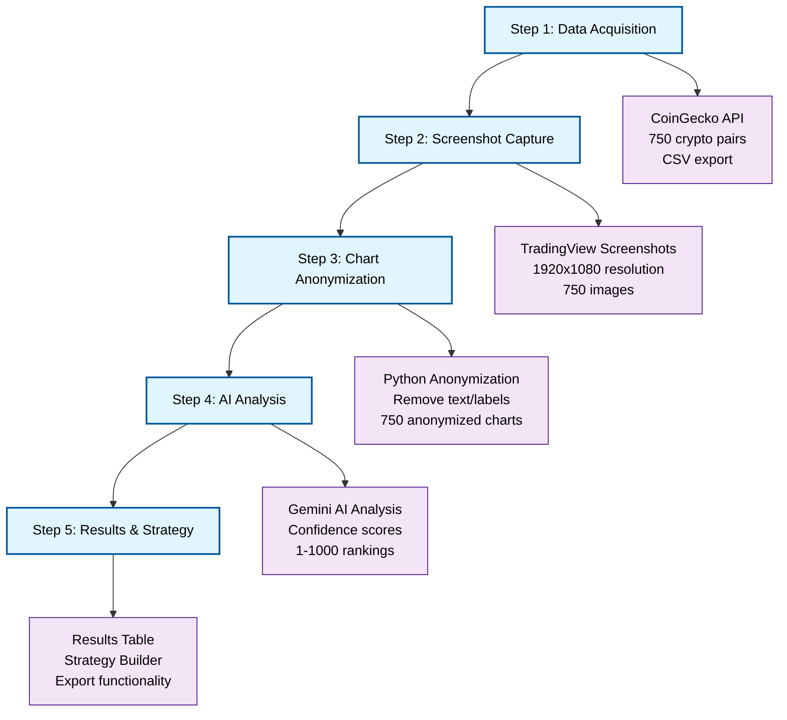
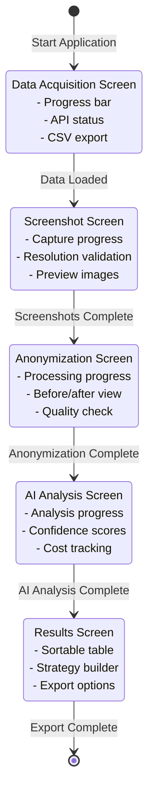

# 🔄 Complete Workflow Interaction Diagrams

## 📋 Overview
This document contains detailed Mermaid interaction diagrams for each of the 5 steps in the crypto strategy builder workflow. Each step represents a unique screen in the web application.

---

## 🎯 Step 1: Data Acquisition Screen
**Screen Purpose**: Fetch crypto data from CoinGecko API (250+ pairs)



**Screen Elements**:
- Progress bar showing batch completion
- Real-time logging of API calls
- Success/failure indicators
- "Next: Screenshots" button (enabled after completion)

---

## 📸 Step 2: Screenshot Capture Screen
**Screen Purpose**: Process existing chart images with Python cropping (1920x1080)



**Screen Elements**:
- Screenshot progress bar (0-750)
- Real-time preview of captured charts
- Resolution validation status
- Failed capture retry options
- "Next: Anonymization" button

---

## 🎭 Step 3: Chart Anonymization Screen
**Screen Purpose**: Run AI analysis on anonymized charts using Gemini



**Screen Elements**:
- Anonymization progress bar
- Before/after image preview
- Quality validation indicators
- Mapping table (coin001 -> BTC, etc.)
- "Next: AI Analysis" button

---

## 🤖 Step 4: AI Analysis Screen
**Screen Purpose**: Generate rankings and confidence scores (1-1000)



**Screen Elements**:
- AI analysis progress bar
- Real-time confidence scores display
- JSON validation status
- Cost tracking (API usage)
- "Next: Results" button

---

## 📊 Step 5: Results & Strategy Screen
**Screen Purpose**: Export results and build strategies



**Screen Elements**:
- Sortable results table (1-1000 ranking)
- Filter options (Top 5, 10, 20, etc.)
- Strategy text editor
- Selected coins display
- Export buttons (CSV, JSON)
- Image gallery (original + cropped)

---

## 🔄 Complete Workflow Integration



---

## 📱 Screen Navigation Flow



---

## ✅ Implementation Requirements Summary

### Database Tables Needed:
1. `crypto_pairs` - Store CoinGecko data
2. `chart_screenshots` - Store screenshot metadata
3. `chart_mappings` - Link original to anonymized
4. `ai_analyses` - Store Gemini results
5. `strategies` - Store user strategies

### API Endpoints Needed:
1. `POST /api/data/fetch` - Trigger data acquisition
2. `POST /api/screenshots/capture` - Trigger screenshot capture
3. `POST /api/anonymize/process` - Trigger anonymization
4. `POST /api/analysis/run` - Trigger AI analysis
5. `GET /api/results` - Get ranked results
6. `POST /api/strategies` - Save user strategies

### File Storage Structure:
```
data/
├── screenshots/
│   ├── originals/
│   └── anonymized/
├── exports/
│   ├── crypto_data.csv
│   └── analysis_results.json
└── strategies/
    └── user_strategies/
```

### Frontend Components Needed:
1. `DataAcquisitionScreen` - Step 1
2. `ScreenshotCaptureScreen` - Step 2
3. `AnonymizationScreen` - Step 3
4. `AIAnalysisScreen` - Step 4
5. `ResultsScreen` - Step 5

---

**Status**: ✅ **COMPLETE** - All 5 steps are fully specified with detailed interaction diagrams and implementation requirements.


